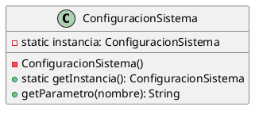

# Patrones GoF aplicados (mín. 3)

## 1) Observer – Notificaciones por eventos
**Problema:** cambios de estado (registro, derivación, observación, cierre) deben notificar a actores distintos (solicitante, oficina destino, auditoría).  
**Solución:** el expediente emite eventos; observadores (Email/SMS/Bitácora) reaccionan sin acoplar la lógica.

```plantuml
@startuml
interface Observer { +update(evento) }
class EmailObserver implements Observer
class SmsObserver implements Observer
class AuditObserver implements Observer

class ExpedienteSubject {
  -observers: List<Observer>
  +attach(o)
  +detach(o)
  +notify(evento)
  +cambiarEstado(nuevo)
}

ExpedienteSubject --> Observer
Observer <|.. EmailObserver
Observer <|.. SmsObserver
Observer <|.. AuditObserver
@enduml
```

## 2) Strategy – Reglas de asignación/derivación
**Problema:** la oficina destino depende del tipo de trámite, prioridad, reglas institucionales o cambios organizativos.  
**Solución:** encapsular criterios en estrategias intercambiables.

```plantuml
@startuml
interface EstrategiaDerivacion { +calcularDestino(expediente): Oficina }
class DerivacionPorTipo implements EstrategiaDerivacion
class DerivacionPorPrioridad implements EstrategiaDerivacion

class MotorDerivacion {
  -estrategia: EstrategiaDerivacion
  +setEstrategia(e)
  +derivar(expediente): Oficina
}

EstrategiaDerivacion <|.. DerivacionPorTipo
EstrategiaDerivacion <|.. DerivacionPorPrioridad
MotorDerivacion --> EstrategiaDerivacion
@enduml
```

## 3) Singleton – Configuración central
**Problema:** parámetros como SLA por tipo, límites de adjuntos, canales de notificación deben ser consistentes.  
**Solución:** una única instancia de configuración accesible por los servicios.



## Dónde aplica en SIGTRAD-UNAP (resumen)
- Observer: en `Servicio Notificaciones` y `Bitácora/Auditoría`.
- Strategy: motor de derivación inicial y reglas de reasignación.
- Singleton: parámetros de sistema (SLA, límites, rutas de almacenamiento).
